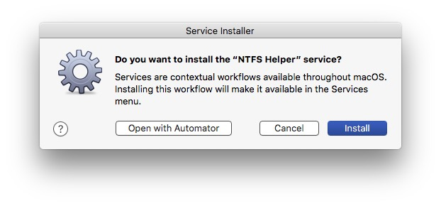

# NTFS Helper for OS X macOS

Enabling Apple's unofficial NTFS write support is an old 'trick', this [Mac OS X Hints article](http://hints.macworld.com/article.php?story=20090913140023382) from **2009** links to a similar app, the original site is down but still available via the Wayback Machine [NTFS Mounter](https://web.archive.org/web/20180308141804/http://www.ntfsmounter.com/).

NTFS Helper consists of two services: **NFTS Watcher** (monitors newly mounted disks and offers to make a NTFS disk writable) and **NTFS Helper** (makes disks writable and cleans hidden OS X specific files and folders before ejecting the NTFS disk). The services can be used together or each on it's own.

NTFS Helper runs on OS X 10.6 Snow Leopard and above.

## How to download and install
Download and extract the NTFS Helper zip file.

[Download latest release](https://github.com/einstweilen/ntfshelper/releases/)

Double click **NTFS Watcher** to install the On Mount folder action.

Double click **NTFS Helper** to install the Finder service.

Both services are installed for the current user only.

## How to use
### NTFS Watcher
Opens up automatically when a NTFS disk is inserted.

to enable write support click OK and enter your password.

As **the Finder won't put a volume icon on the Desktop** the Volumes folder is opend for accessing the files on the NTFS volume. 

**Tip:** Put a quick link to the Volumes folder to your Finder's sidebar by clicking the folder icon on the Finder window an drag and drop it to the favorites section of your sidebar. You can also place an alias of the NTFS volume on your desktop.

### NTFS Helper
Right click on the disk icon of a NTFS drive and select 'NTFS Helper' from the Finder context menu.

**Case One** - the NTFS disk is read-only

NTFS Watcher offers to enable NTFS write support.

To enable write support click OK and enter your password.

**Case Two** - the NTFS disk is already writable

You can choose to delete the pesky OS X files and folders which regulary confuse Windows computers and users.

These files and folders will be deleted:

*  ._
*  __MACOSX
*  .DS_Store
*  .Trashes
*  .fseventsd
* .Spotlight-V100
* .TemporaryItems

When you connect the disk the next time it will be mounted read-writable again.

**or**
you choose to **additionally** remove the disk from the list of known NTFS disks.

NTFS Watcher will kick in the next time you insert the disk and will ask if you want the write supported to be enabled again.
This avoids a growing list of disks that only where used once.

**Case Three** - the disk has the wrong format
If you try to use NTFS Helper with a non-NTFS disk an info dialog is shown.

## How to uninstall
Open the Folder Action and Service folder and drag the installed workflows

to the bin.
